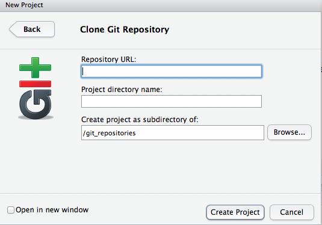

## Git - Notes
### Alan T. Arnholt


Last compiled Monday, January 27, 2014 - 1:52:28 PM..

Download and install the lastest version of [Git.](http://git-scm.com/downloads)


If you have never used git before, you need to do some setup first.  Run the following
commands so that git knows your name and email.  The commands are all issued in the
Terminal (MAC) or at the command prompt of Git Bash (Windows).  The Terminal 
application is usually found in `/applications/Utilities`.  To open Git Bash, click on the 
Windows icon -> ??? finish this in class.  The third line adds pretty command line colors.  


```bash
git config --global user.name "Your Name"
git config --global user.email "your_email@whatever.com"
git config --global color.ui true
```


If you do not want to type your username and password every time you work with a remote server, you will to install the credential helper.  See the article [Set Up Git](https://help.github.com/articles/set-up-git#platform-all) for additional details on setting up the credential helper.


### Creating a GitHub Account

Point your browser to [https://github.com](https://github.com),
type a username in the `Pick a username` box (please use `firstlast`, for example my username is `alanarnholt`), enter your email (use your school email) in the `Your email` box, type in your password in the `Create a password` box. Then, click the `Sign up for GitHub` box and you will have a GitHub account.


### Creating a GitHub Repository

In order to push your local work to a remote repository, you will first need to create
the remote repository. Log into your GitHub account, click the `New repository` button,
then give your repository a name and optionally a description.  When you finish, click 
the `Create repository` button and your GitHub repository will be created.  


This document is stored in the repository [https://github.com/alanarnholt/STT4870](https://github.com/alanarnholt/STT4870) in the folder [https://github.com/alanarnholt/STT4870/Git](https://github.com/alanarnholt/STT4870/Git). 

## Local Repositories

It is possible to set up a local repository using GUI (drop, drag, etc.) commands or to
use the command line.  I keep my repositories in a folder called *git_repositories* that
is a subfolder of my *USERNAME* directory.  Once you have a local folder with files you
would like to place under version control, use the `git init` command from your working
directory to track your files.  If you clone a remote repository to your machine, you 
will not need to initialize your directory.  One way to clone this repo using `RStudio` is 
to click on File -> New Project 


Click Version Control and a new window such as the one below will appear where you will select Git.


In the next window that appears, which is shown below, enter the URL for the repository you are cloning.  Enter a project name and specify where you want the project to reside on your computer.  When you are finished, click the `Create Project` button and you will have cloned a remote repository.




To check the current status of your repository type:


